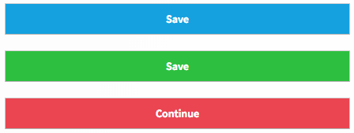

# Button

This component implements the `<Button>` react component.



## Usage

```
  <Button onClick={action('click')}>Save</Button>
  <Button onClick={action('click')} bg='coolGreen'>Save</Button>
  <Button onClick={action('click')} bg='watermelon'>Continue</Button>
  <Button onClick={action('click')} bg='watermelon' disabled>I'm a disabled button</Button>
```

## Props
It accepts all the HTML button properties

|   Name |  Type | Required | Default | Description |
|---|---|---|---|---|
| bg | string (from the list of the theme color)|  | waterBlue | The background of the button
| color | string (from the list of the theme color) |  | white | The color of the button
| height | string |  | '40ox' | The height of the button
| width | string |  | '100%' | The width of the button